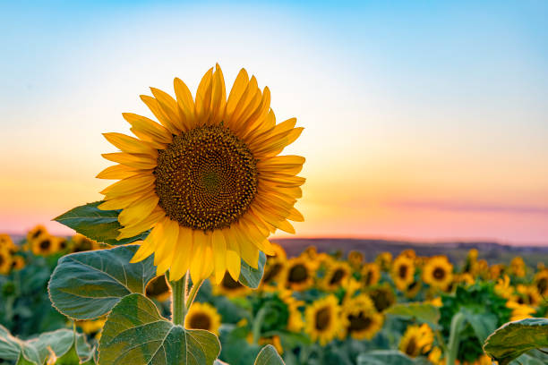
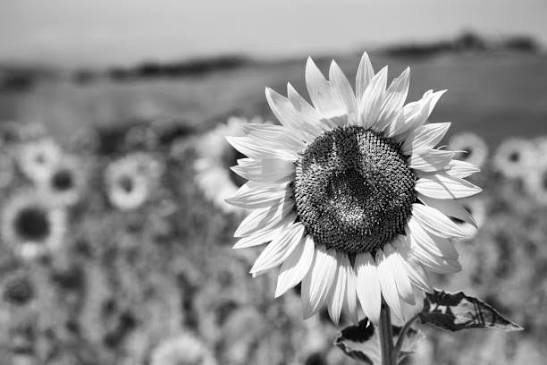
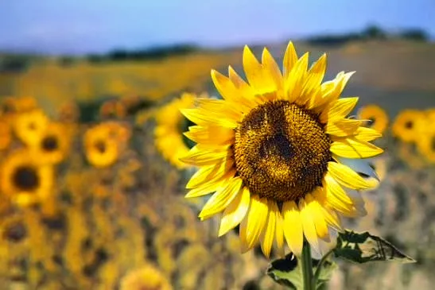

# AI-Driven Grayscale Image Colorization Using Deep Generative Models

## 📌 Project Overview

This project uses Generative AI and deep learning to automatically transform black-and-white images into visually realistic color images.

The system uses the **DDColor** pretrained deep learning model to predict suitable color information from grayscale images. OpenCV is used for image processing and enhancement, while Gradio provides an interactive web interface.

## ✨ Features

- AI-powered grayscale image colorization
- DDColor deep learning model
- Original, grayscale, and AI colorized image comparison
- Color enhancement
- Downloadable colorized result
- Interactive Gradio interface
- Deep learning-based computer vision

## 🛠️ Technologies Used

- Python
- PyTorch
- DDColor
- OpenCV
- NumPy
- Pillow
- Gradio
- Generative AI

## 🔬 Workflow

```text
Black & White Image
        ↓
Image Preprocessing
        ↓
DDColor Deep Learning Model
        ↓
Color Prediction
        ↓
Color Enhancement
        ↓
AI Colorized Image

## 🖼️ Colorization Results

### Original Image


### Grayscale Image


### AI Colorized Image

